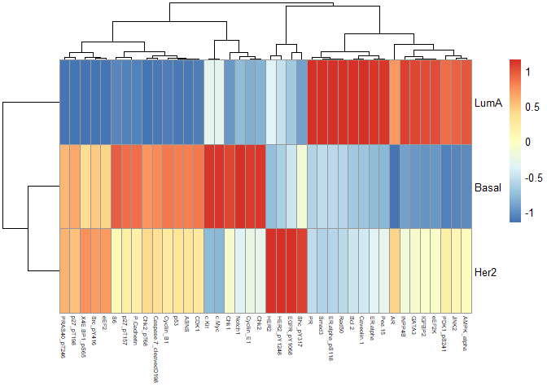
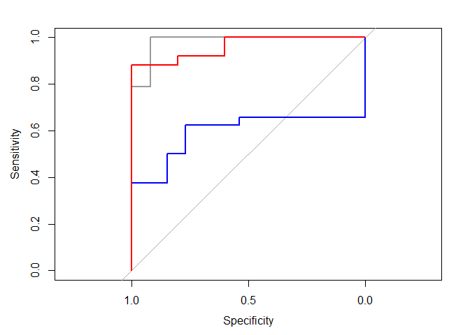

Predict cancer subtypes from protein level signatures with random forest
model
================
Malina Doynova
5/02/2024

# 1. Install and/or load the required packages

``` r
# install.packages("BiocManager")
# BiocManager::install(c("phyloseq", "vegan", "microbiome", "Maaslin2"))
# BiocManager::install(c("microbiomeMarker"))
# BiocManager::install(c("ggplot2", "tidyverse", "dplyr", "data.table"))
# install.packages("https://cran.r-project.org/src/contrib/Archive/randomForest/randomForest_4.6-14.tar.gz", repos = NULL, type = "source")

library(mixOmics)
```

    ## Loading required package: MASS

    ## Loading required package: lattice

    ## Loading required package: ggplot2

    ## 
    ## Loaded mixOmics 6.26.0
    ## Thank you for using mixOmics!
    ## Tutorials: http://mixomics.org
    ## Bookdown vignette: https://mixomicsteam.github.io/Bookdown
    ## Questions, issues: Follow the prompts at http://mixomics.org/contact-us
    ## Cite us:  citation('mixOmics')

``` r
library(igraph)
```

    ## 
    ## Attaching package: 'igraph'

    ## The following objects are masked from 'package:stats':
    ## 
    ##     decompose, spectrum

    ## The following object is masked from 'package:base':
    ## 
    ##     union

``` r
library(randomForest)
```

    ## randomForest 4.7-1.1

    ## Type rfNews() to see new features/changes/bug fixes.

    ## 
    ## Attaching package: 'randomForest'

    ## The following object is masked from 'package:ggplot2':
    ## 
    ##     margin

``` r
library(caret)
```

    ## 
    ## Attaching package: 'caret'

    ## The following objects are masked from 'package:mixOmics':
    ## 
    ##     nearZeroVar, plsda, splsda

``` r
library(pROC)
```

    ## Type 'citation("pROC")' for a citation.

    ## 
    ## Attaching package: 'pROC'

    ## The following objects are masked from 'package:stats':
    ## 
    ##     cov, smooth, var

``` r
library(pheatmap)
```

# 2. Set the working directory

``` r
setwd("C://Users//Malina//Desktop//RF_BC_subtypes_predict/")
```

# 3. Load the example dataset

The example dataset is from the package mixOmics. Rownames are patients
and column are the proteins (sometimes with post-translational
modification like “4E-BP1_pT37”). The data is normalized. We will call
the variable mRNA, but will know the current analyses are done for
normalized protein counts. We also know what type of cancer the patients
were diagnosed with, which is contained in the Y variable and will add
it to the dataframe as an additional column, so we will have our
outcome.

``` r
data(breast.TCGA)

## Explore the dataset
mRNA = breast.TCGA$data.train$protein

dim(mRNA)
```

    ## [1] 150 142

``` r
head(mRNA[,1:20])
```

    ##      14-3-3_epsilon     4E-BP1 4E-BP1_pS65 4E-BP1_pT37 4E-BP1_pT70       53BP1
    ## A0FJ     0.04913078  0.4474862 -0.07432175  -0.3811629  0.02606943  0.91783419
    ## A13E    -0.07998211  0.6052184  0.28891184   1.1602454 -0.01096717  0.05910121
    ## A0G0    -0.03284989  0.8946097  0.89127784   1.4001889  0.26588012  0.51704453
    ## A0SX    -0.20532949 -0.1413229 -0.01841096  -0.4442243 -0.05126772 -0.31372867
    ## A143     0.06019021  0.1317690  0.66532539   0.3517633  0.06980286  0.33091238
    ## A0DA     0.03076171  0.0329968  0.05236064   0.7892360  0.01704555 -0.22027100
    ##      A-Raf_pS299        ACC1   ACC_pS79  AMPK_alpha  AMPK_pT172       ANLN
    ## A0FJ  0.02274147 -0.08626782 -0.4166244  0.28527039  0.07659533 0.17231110
    ## A13E -0.45985298 -0.59269183 -0.0622684 -0.27523360 -0.14897676 0.22210598
    ## A0G0 -0.19182192  0.41117190  0.8258286  0.06774184  0.71122916 0.12199399
    ## A0SX -0.07482347 -0.85148060 -0.6634104  0.02956373  0.42335804 1.05494810
    ## A143 -0.02435747  0.76975143  0.8734787 -0.21653182 -0.47414555 0.01378422
    ## A0DA  0.41861665 -0.71430870 -0.2175268 -0.06306506 -0.04603971 0.06025690
    ##              AR     ARID1A      ASNS         ATM          Akt  Akt_pS473
    ## A0FJ -1.3076057  0.5050945 0.8114629 -0.49594473 -0.001377255 -0.5215168
    ## A13E -1.6204760  0.3395816 1.1810158 -0.27553339 -0.755547887  0.3024077
    ## A0G0 -1.0778944  0.2271807 1.9509224  0.77085780 -0.067397666  1.6739827
    ## A0SX -1.2670547  0.3552977 0.6074238  0.78132869  0.056726701 -0.3884839
    ## A143 -0.6013274  0.5441251 0.5387629  0.01385431  0.238114357  1.6713476
    ## A0DA -1.2080385 -0.1109448 0.3119495  0.07174832  0.193712038  0.5128177
    ##       Akt_pT308   Annexin_I
    ## A0FJ 0.38153872 -0.09290929
    ## A13E 0.07748138  0.19474984
    ## A0G0 0.83743199  1.25299238
    ## A0SX 0.31431844  0.57527418
    ## A143 2.36407695 -1.55700359
    ## A0DA 0.19289383  0.49101519

``` r
## Get Breast Cancer subtype column

Y <- breast.TCGA$data.train$subtype
summary(Y)
```

    ## Basal  Her2  LumA 
    ##    45    30    75

``` r
## Merge the protein level data with the outcome column

gene_expr_data= data.frame(cbind((mRNA),data.frame(Y)))

head(gene_expr_data[,1:20])
```

    ##      X14.3.3_epsilon    X4E.BP1 X4E.BP1_pS65 X4E.BP1_pT37 X4E.BP1_pT70
    ## A0FJ      0.04913078  0.4474862  -0.07432175   -0.3811629   0.02606943
    ## A13E     -0.07998211  0.6052184   0.28891184    1.1602454  -0.01096717
    ## A0G0     -0.03284989  0.8946097   0.89127784    1.4001889   0.26588012
    ## A0SX     -0.20532949 -0.1413229  -0.01841096   -0.4442243  -0.05126772
    ## A143      0.06019021  0.1317690   0.66532539    0.3517633   0.06980286
    ## A0DA      0.03076171  0.0329968   0.05236064    0.7892360   0.01704555
    ##           X53BP1 A.Raf_pS299        ACC1   ACC_pS79  AMPK_alpha  AMPK_pT172
    ## A0FJ  0.91783419  0.02274147 -0.08626782 -0.4166244  0.28527039  0.07659533
    ## A13E  0.05910121 -0.45985298 -0.59269183 -0.0622684 -0.27523360 -0.14897676
    ## A0G0  0.51704453 -0.19182192  0.41117190  0.8258286  0.06774184  0.71122916
    ## A0SX -0.31372867 -0.07482347 -0.85148060 -0.6634104  0.02956373  0.42335804
    ## A143  0.33091238 -0.02435747  0.76975143  0.8734787 -0.21653182 -0.47414555
    ## A0DA -0.22027100  0.41861665 -0.71430870 -0.2175268 -0.06306506 -0.04603971
    ##            ANLN         AR     ARID1A      ASNS         ATM          Akt
    ## A0FJ 0.17231110 -1.3076057  0.5050945 0.8114629 -0.49594473 -0.001377255
    ## A13E 0.22210598 -1.6204760  0.3395816 1.1810158 -0.27553339 -0.755547887
    ## A0G0 0.12199399 -1.0778944  0.2271807 1.9509224  0.77085780 -0.067397666
    ## A0SX 1.05494810 -1.2670547  0.3552977 0.6074238  0.78132869  0.056726701
    ## A143 0.01378422 -0.6013274  0.5441251 0.5387629  0.01385431  0.238114357
    ## A0DA 0.06025690 -1.2080385 -0.1109448 0.3119495  0.07174832  0.193712038
    ##       Akt_pS473  Akt_pT308   Annexin_I
    ## A0FJ -0.5215168 0.38153872 -0.09290929
    ## A13E  0.3024077 0.07748138  0.19474984
    ## A0G0  1.6739827 0.83743199  1.25299238
    ## A0SX -0.3884839 0.31431844  0.57527418
    ## A143  1.6713476 2.36407695 -1.55700359
    ## A0DA  0.5128177 0.19289383  0.49101519

``` r
gene_expr_data$Y = as.factor(gene_expr_data$Y)
dim(gene_expr_data)
```

    ## [1] 150 143

``` r
## Assing the dataframe with only 40 features to gene_expr_data
# gene_expr_data = mRNA_imp
# 
# dim(gene_expr_data)
# 
# head(gene_expr_data[,1:20])
# 
# levels(gene_expr_data$Y)
```

# 4. Split data into training and testing sets

``` r
set.seed(123) # for reproducibility
train_index <- sample(1:nrow(gene_expr_data), 0.7 * nrow(gene_expr_data)) # 70% for training
train_data <- gene_expr_data[train_index, ]

test_data <- gene_expr_data[-train_index, ]
```

# 5. Train Random Forest model

``` r
## include 10x cross-validation
ctrl <- caret::trainControl(method = "cv", number = 10)

rf_model <- randomForest(Y ~ ., data = train_data, trControl = ctrl, ntree = 500)
```

# 6. Feature Selection

``` r
importance <- importance(rf_model)
importance = data.frame(importance)
head(importance)
```

    ##                 MeanDecreaseGini
    ## X14.3.3_epsilon       0.19474043
    ## X4E.BP1               0.04663156
    ## X4E.BP1_pS65          0.49571299
    ## X4E.BP1_pT37          0.09565266
    ## X4E.BP1_pT70          0.30375322
    ## X53BP1                0.32094447

``` r
importance$genes = rownames(importance)
top_features <- importance%>%dplyr::arrange(desc(MeanDecreaseGini))%>%head(40) # Select top number features
head(top_features, n=40)
```

    ##                       MeanDecreaseGini                 genes
    ## GATA3                        4.6899238                 GATA3
    ## ER.alpha                     3.9635136              ER.alpha
    ## AR                           3.3683331                    AR
    ## ASNS                         2.4369720                  ASNS
    ## Cyclin_B1                    2.0675439             Cyclin_B1
    ## Cyclin_E1                    1.8881327             Cyclin_E1
    ## HER2                         1.8688485                  HER2
    ## JNK2                         1.8549916                  JNK2
    ## Bcl.2                        1.8524401                 Bcl.2
    ## PR                           1.8200528                    PR
    ## INPP4B                       1.8066982                INPP4B
    ## PDK1_pS241                   1.4795675            PDK1_pS241
    ## HER2_pY1248                  1.4092551           HER2_pY1248
    ## Chk2_pT68                    1.2235704             Chk2_pT68
    ## CDK1                         1.1105127                  CDK1
    ## ER.alpha_pS118               0.9807624        ER.alpha_pS118
    ## c.Kit                        0.9196609                 c.Kit
    ## Smad3                        0.8237046                 Smad3
    ## EGFR_pY1068                  0.8054448           EGFR_pY1068
    ## IGFBP2                       0.7547849                IGFBP2
    ## p53                          0.7339954                   p53
    ## Caspase.7_cleavedD198        0.6439808 Caspase.7_cleavedD198
    ## S6                           0.6162066                    S6
    ## eEF2K                        0.5541948                 eEF2K
    ## X4E.BP1_pS65                 0.4957130          X4E.BP1_pS65
    ## Notch1                       0.4817083                Notch1
    ## p27_pT157                    0.4739539             p27_pT157
    ## PRAS40_pT246                 0.4562152          PRAS40_pT246
    ## Chk1                         0.4498631                  Chk1
    ## AMPK_alpha                   0.4413610            AMPK_alpha
    ## Rad50                        0.3815519                 Rad50
    ## Src_pY416                    0.3811929             Src_pY416
    ## c.Myc                        0.3698122                 c.Myc
    ## P.Cadherin                   0.3641087            P.Cadherin
    ## eEF2                         0.3551072                  eEF2
    ## Shc_pY317                    0.3460913             Shc_pY317
    ## Chk2                         0.3457406                  Chk2
    ## Pea.15                       0.3423205                Pea.15
    ## Caveolin.1                   0.3403394            Caveolin.1
    ## p27_pT198                    0.3302624             p27_pT198

# 7. Evaluate Model Performance and Print results

``` r
# Model evaluation

predictions1 <- predict(rf_model, newdata = test_data)


# Compute confusion matrix
conf_matrix <- table(test_data$Y, predictions1)

# Calculate precision
precision <- conf_matrix[2, 2] / sum(conf_matrix[, 2])

# Calculate recall (sensitivity)
recall <- conf_matrix[2, 2] / sum(conf_matrix[2, ])

# Calculate specificity
specificity <- conf_matrix[1, 1] / sum(conf_matrix[1, ])

# Calculate F1 score
f1_score <- 2 * (precision * recall) / (precision + recall)

# Calculate accuracy

accuracy <- sum(diag(conf_matrix)) / sum(conf_matrix)

# Print the metrics

print(conf_matrix)
```

    ##        predictions1
    ##         Basal Her2 LumA
    ##   Basal    11    0    1
    ##   Her2      0   10    3
    ##   LumA      0    0   20

``` r
print(paste("Accuracy:", accuracy))
```

    ## [1] "Accuracy: 0.911111111111111"

``` r
print(paste("Precision:", precision))
```

    ## [1] "Precision: 1"

``` r
print(paste("Recall (Sensitivity):", recall))
```

    ## [1] "Recall (Sensitivity): 0.769230769230769"

``` r
print(paste("Specificity:", specificity))
```

    ## [1] "Specificity: 0.916666666666667"

``` r
print(paste("F1 Score:", f1_score))
```

    ## [1] "F1 Score: 0.869565217391304"

Precision: Precision measures the accuracy of positive predictions made
by the model. It is calculated as the number of true positive
predictions divided by the total number of positive predictions made by
the model. A high precision indicates that the model is good at
correctly identifying positive cases without incorrectly classifying
negative cases as positive.

Recall (Sensitivity): Recall, also known as sensitivity or true positive
rate, measures the ability of the model to correctly identify all
positive instances. It is calculated as the number of true positive
predictions divided by the total number of actual positive instances in
the data. High recall indicates that the model is good at capturing
positive instances without missing many of them.

Specificity: Specificity measures the ability of the model to correctly
identify all negative instances. It is calculated as the number of true
negative predictions divided by the total number of actual negative
instances in the data. High specificity indicates that the model is good
at correctly classifying negative instances without misclassifying
positive instances as negative.

F1 Score: The F1 score is the harmonic mean of precision and recall. It
provides a single metric that balances both precision and recall. It is
calculated as 2 times the product of precision and recall divided by the
sum of precision and recall. The F1 score ranges from 0 to 1, where a
higher value indicates better overall performance in terms of both
precision and recall.

Accuracy: Accuracy measures the overall correctness of the model’s
predictions across all classes. It is calculated as the number of
correct predictions (both true positives and true negatives) divided by
the total number of predictions made by the model. High accuracy
indicates that the model is making correct predictions for the majority
of instances.

# 8. Plot top important features averaged across the subtypes of cancer

``` r
cluster_genes = top_features$genes
length(cluster_genes) 
```

    ## [1] 40

``` r
# only select the proteins that are most important features for the model 
mRNA_imp = gene_expr_data[,c(cluster_genes,"Y")]

# Calculate average expression of each gene for each cancer type

average_expr <- aggregate(. ~ Y, data = mRNA_imp, FUN = mean)

# Transpose the dataframe for better visualization
average_expr <- data.frame(t(average_expr))
colnames(average_expr) = c("Basal", "Her2", "LumA")
# Remove the 'Y' row (as it's not a gene)
average_expr <- average_expr[!rownames(average_expr) %in% "Y", ]

average_expr = data.frame(average_expr)

# Apply as.numeric to each column of the dataframe
average_expr[] <- lapply(average_expr, as.numeric)

head(average_expr)
```

    ##                Basal       Her2       LumA
    ## GATA3     -1.4704895 -0.5605194  0.6583642
    ## ER.alpha  -3.1015010 -2.1714050  1.0185770
    ## AR        -1.0391176  0.2281543  0.4478149
    ## ASNS       0.6607893  0.3841498 -0.3321692
    ## Cyclin_B1  0.8028507  0.3257561 -0.7455243
    ## Cyclin_E1  0.8275955  0.1696257 -0.1095149

``` r
pheatmap(t(average_expr), fontsize_col = 5,fontsize_row = 10,
         height = 18, width = 16, cluster_cols = TRUE, scale = "column")
```

<!-- -->

From the pheatmap it is obvious there is great separation between the
three cancer subtypes. Her2 pos cancer has high levels of Her2 proteins
expressed. LumA has high protein levels of hormone receptors such as AR,
ER, PR and also GATA3 protein levels. The Basal subtype is represented
rather by proteins involved in the progression of cell cycle and those
far is the most difficult to treat.

# 9. Plot ROC and calculate AUC for each cancer subtype

``` r
# predict class and then attach test class
predictions <- as.data.frame(predict(rf_model, newdata = test_data, type = "prob"))
predictions$predict <- names(predictions)[1:3][apply(predictions[,1:3], 1, which.max)]
predictions$observed <- test_data$Y
head(predictions)
```

    ##      Basal  Her2  LumA predict observed
    ## A0FJ 0.772 0.144 0.084   Basal    Basal
    ## A13E 0.838 0.104 0.058   Basal    Basal
    ## A0G0 0.716 0.208 0.076   Basal    Basal
    ## A143 0.510 0.432 0.058   Basal    Basal
    ## A124 0.788 0.144 0.068   Basal    Basal
    ## A0AL 0.780 0.140 0.080   Basal    Basal

``` r
#  ROC curve, Basal vs non Basal
roc.Basal <- roc(ifelse(predictions$observed=="Basal", "Basal", "non-Basal"), as.numeric(predictions$Basal))
```

    ## Setting levels: control = Basal, case = non-Basal

    ## Setting direction: controls > cases

``` r
plot(roc.Basal, col = "gray60")

# others
roc.Her2 <- roc(ifelse(predictions$observed=="Her2", "Her2", "non-Her2"), as.numeric(predictions$Basal))
```

    ## Setting levels: control = Her2, case = non-Her2
    ## Setting direction: controls > cases

``` r
roc.LumA <- roc(ifelse(predictions$observed=="LumA", "LumA", "non-LumA"), as.numeric(predictions$Basal))
```

    ## Setting levels: control = LumA, case = non-LumA

    ## Setting direction: controls < cases

``` r
lines(roc.Her2, col = "blue")
lines(roc.LumA, col = "red")
```

<!-- -->

``` r
roc.Basal$auc
```

    ## Area under the curve: 0.9823

``` r
roc.Her2$auc
```

    ## Area under the curve: 0.5938

``` r
roc.LumA$auc
```

    ## Area under the curve: 0.96
